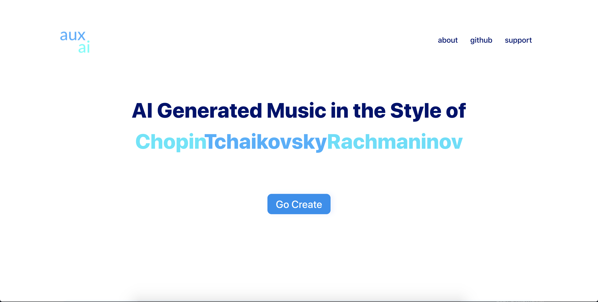
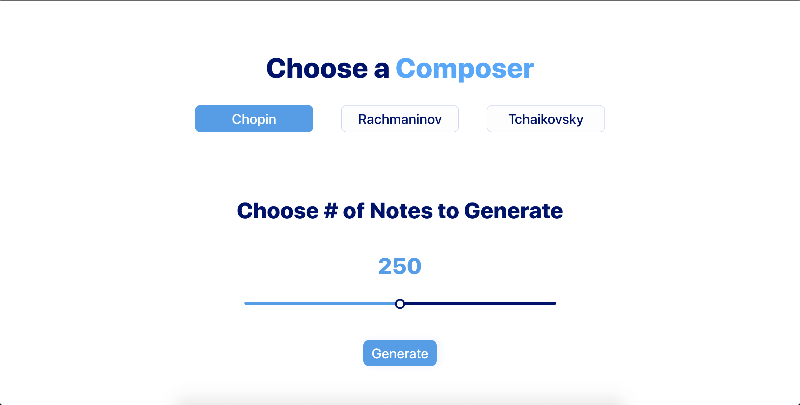

  

Welcome to Aux.ai, both an web-based AI powered entertainment platform lets users generate musical compositions and an educational platform that gives insights into how to 'do-it-yourself'. Happy composing! 

 

    

 

<a href="https://aux-ai.dev.novichkov.dev/">Official Website</a>

 

## Table of Contents
-   [Documentation](#documentation)
-   [Todo](#todo)
-   [Scope](#scope)
-   [Design](#design)
-   [License](#license)
-   [Contributors](#contributors)

<a name="documentation"/>

## Documentation

#### Personal Assessment of Progress
The MVP for this project was to deploy a platform that uses AI to generate music based on a composer. This product exceeds
my original expectations for an MVP, with a interactive design, multiple composers and the ability to play results right in the browser. 
The results are very promising for the stage at which this project is at, with Chopin and Rachmaninov models especially producing very good samples. It is very hard
to numerically evaluate a model that is designed to be evaluated with hearing, so please just access the platform and generate a couple of songs to see how good it is for yourself!
   
#### The Journey
This project was started from a clean slate, as I had no prior experience with music generation, or the kinds of models that were used for this kind of project. 
Luckily for me I found a lot of great resources that are linked in the <a href="https://www.notion.so/Aux-ai-e06290086c764ebcb89dc5621e4d7d20">Notion Doc</a> for this project. I got access to some code samples that do encoding, model creation and decoding generated music as well as a huge database of MIDI files of all different kinds of music.
I decided to focus on piano pieces of several composers and soon after zeroed in on Chopin, Rachmaninov and Tchaikovski as they had the most MIDI files to their names.   
After a couple of days struggling to make the LSTM model predict good results, I fixed a bug in one of the code samples that I was using and the model has been able to generate mostly good music since then. Then came optimization, and I spend a good amount of weeks playing around with different model
sizes and layers, as well as the sequence length of training data. While working on that, I started developing the React frontend and the Flask API endpoints.  
  
  
After some experimentation, I zeroed in on a model with 2 LSTM layers with 1 Attention layer in between, and 2 Dense layers, one of which was the output layer of the model. I found that using sequence length of 40 gave me the best results when it came to not overfitting the model, and the generated samples 
copy exact song passages more rarely than models with larger sequence lengths. After developing the frontend and backend, I ran into the issue of playing generated MIDI files right in the browser, and solved that problem by converting MIDI files to Mp3 as a separate endpoint call, since I can play mp3 files in
the browser using the <audio> html element. I then ran into the issue where my model weights for the three composers were too big to deploy right to the server, so I am utilizing AWS s3 to download the model files when the API initializes. 

#### Running the Application

The app is deployed at https://aux-ai.dev.novichkov.dev/ and the notebook code is available under the /notebook directory in the project repo. Please visit the web app though if you want to see the AI in action.   

    

<a name="todo"/>

## Todo

Visit the <b>Notion</b> link [here](https://www.notion.so/Aux-ai-e06290086c764ebcb89dc5621e4d7d20) to view Aux-ai's feature/bug progress and summary of resources.

<a name="scope"/>

## Scope

I believe that the scope of this project is justified given I have a month to complete this project

<a name="design"/>

## Design
You can access the XD design docs [here](https://xd.adobe.com/view/b53c1d42-25cc-4bbd-5046-bc056b108fba-c30d/)

## 📝 License

By contributing, you agree that your contributions will be licensed under its MIT License.

In short, when you submit code changes, your submissions are understood to be under the same [MIT License](http://choosealicense.com/licenses/mit/) that covers the project. Feel free to contact the maintainers if that's a concern.

## Contributors

Contributions are welcome! 

<table>
  <tr>
    <td align="center"><a href="https://github.com/apnovichkov"> <b>Andrey Novichkov</b></a> <a href="https://github.com/APNovichkov/aux-ai-api/commits?author=APNovichkov" title="Code">💻</a></td>
  </tr>
</table>
