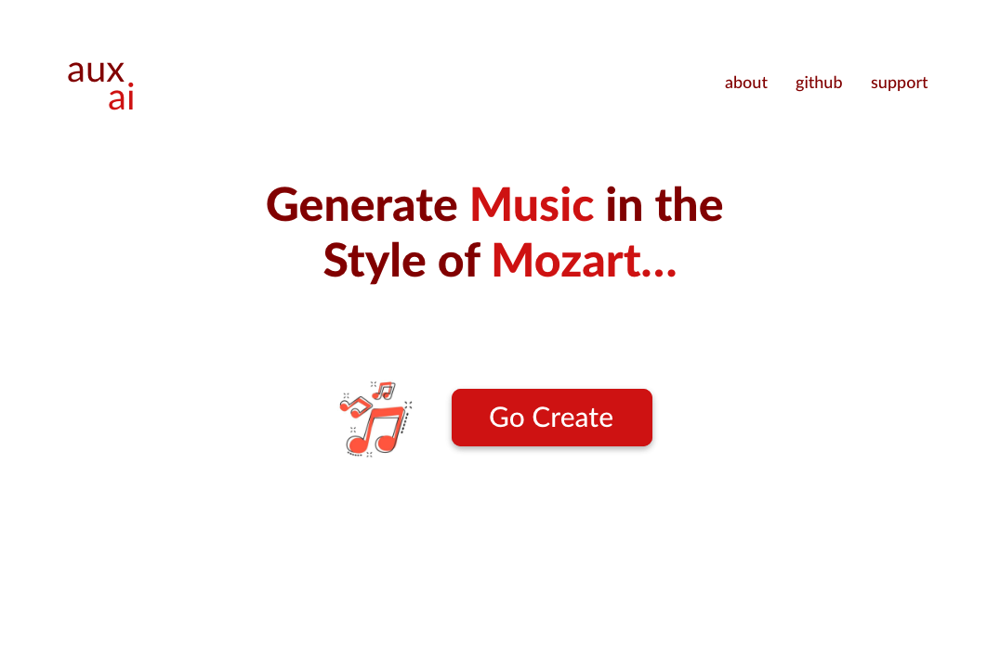

  

Welcome to Aux.ai, both an entertainment platform that uses AI to generate musical compositions and an educational platform that gives insights into how to 'do-it-yourself'. Happy composing! 

 

    

 

<a href="">Official Website</a>

 

## Table of Contents
-   [Todo](#todo)
-   [Scope](#scope)
-   [Design](#design)
-   [License](#license)
-   [Contributors](#contributors)

<a name="toto"/>

## Todo

Visit the <b>Notion</b> link [here]() to view Aux-ai's feature/bug progress and summary of resources.

<a name="scope"/>

## Scope

I believe that the scope of this project is justified given I have a month to complete this project

<a name="design"/>

## Design
You can access the XD design docs [here](https://xd.adobe.com/view/b53c1d42-25cc-4bbd-5046-bc056b108fba-c30d/)

## 📝 License

By contributing, you agree that your contributions will be licensed under its MIT License.

In short, when you submit code changes, your submissions are understood to be under the same [MIT License](http://choosealicense.com/licenses/mit/) that covers the project. Feel free to contact the maintainers if that's a concern.

## Contributors

Contributions are welcome! 

<table>
  <tr>
    <td align="center"><a href="https://github.com/apnovichkov"> <b>Andrey Novichkov</b></a> <a href="https://github.com/APNovichkov/aux-ai-api/commits?author=APNovichkov" title="Code">💻</a></td>
  </tr>
</table>
